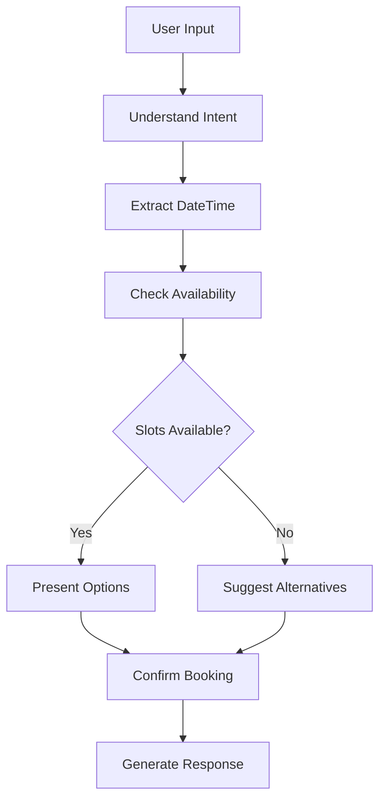

# 🤖 Tailor-Talk: AI Appointment Booking Assistant

A sophisticated conversational AI agent built with **LangGraph** that can naturally assist users in booking appointments on Google Calendar. The system features a beautiful **Streamlit** frontend and a robust **FastAPI** backend for seamless appointment management.

## ✨ Features

- **🗣️ Natural Conversation**: Handles complex, multi-turn conversations about scheduling
- **🧠 Intent Understanding**: Uses LangGraph state machines to understand user intent
- **📅 Calendar Integration**: Full Google Calendar API integration with read/write access
- **🎯 Smart Scheduling**: Automatically finds available slots and suggests alternatives
- **⚡ Real-time Booking**: Books appointments directly to your Google Calendar
- **🎨 Modern UI**: Beautiful, responsive Streamlit interface
- **🔌 API Backend**: RESTful FastAPI backend for integration with other systems
- **🔐 Secure**: OAuth 2.0 authentication with Google Calendar API

## 🎯 What Your Agent Can Do

### Example Conversations:
- **User**: "Hey, I want to schedule a call for tomorrow afternoon."
- **Agent**: *Checks calendar, finds available slots, presents options*

- **User**: "Do you have any free time this Friday?"
- **Agent**: *Shows Friday's available time slots with interactive selection*

- **User**: "Book a meeting between 3-5 PM next week."
- **Agent**: *Searches for slots in that time range and confirms booking*

## 📁 Project Structure

```
tailor-talk/
├── agent/                   # 🧠 LangGraph conversational flow
│   ├── __init__.py
│   └── flow.py             # Main agent with state management
├── backend/                 # ⚡ FastAPI REST API
│   ├── __init__.py
│   └── api.py              # API endpoints for booking
├── calendar/                # 📅 Google Calendar integration
│   ├── __init__.py
│   └── gcal.py             # Calendar operations & booking
├── frontend/                # 🎨 Streamlit chat interface
│   └── app.py              # Interactive chat UI
├── credentials.json         # 🔑 Google API credentials
├── requirements.txt         # 📦 Python dependencies
├── start.bat               # 🚀 Windows startup script
├── start.sh                # 🚀 Unix startup script
└── README.md               # 📖 This file
```

## � Quick Start

### 1. **Clone and Setup**
```bash
git clone <your-repo>
cd tailor-talk
pip install -r requirements.txt
```

### 2. **Google Calendar Setup** 🔧

1. Go to [Google Cloud Console](https://console.cloud.google.com/)
2. Create a new project or select existing one
3. Enable the **Google Calendar API**
4. Create **OAuth 2.0 Client ID** credentials (Desktop Application)
5. Download the JSON file and rename it to `credentials.json`
6. Place it in the project root directory

### 3. **Run the Application** 🎮

#### Option A: Streamlit Only (Recommended for demo)
```bash
# Windows
start.bat

# Linux/Mac
chmod +x start.sh
./start.sh
```

#### Option B: Full Stack (Streamlit + FastAPI)
```bash
# Terminal 1: Start FastAPI backend
python backend/api.py

# Terminal 2: Start Streamlit frontend
streamlit run frontend/app.py
```

### 4. **Access the Application** 🌐
- **Chat Interface**: http://localhost:8501
- **API Documentation**: http://localhost:8000/docs (if running FastAPI)

## 🔧 Configuration

### Environment Variables (Optional)
```bash
export OPENAI_API_KEY="your-openai-key-here"  # For enhanced responses
```

### Google Calendar Scopes
The application requires these permissions:
- `calendar.readonly` - Read calendar events
- `calendar.events` - Create and modify events

## 📖 Usage Guide

### 💬 Chat Interface
1. **Initialize the Agent** - Click "Initialize Agent" in the sidebar
2. **Connect Calendar** - Click "Connect Calendar" (OAuth flow will open)
3. **Start Chatting** - Use natural language to book appointments

### 🎯 Example Interactions

```
You: "I need to schedule a team meeting for next Friday"
Agent: "I found several available slots for Friday:
        1. 10:00 AM - 11:00 AM
        2. 2:00 PM - 3:00 PM
        3. 4:00 PM - 5:00 PM
        Which time works best for you?"

You: "Let's go with option 2"
Agent: "Perfect! I've booked your team meeting for Friday, 
        December 30th at 2:00 PM. You'll receive a calendar 
        invite shortly."
```

### 🔌 API Usage

```python
import requests

# Chat with the agent
response = requests.post("http://localhost:8000/chat", json={
    "message": "I want to book a meeting tomorrow at 3 PM",
    "session_id": "user123"
})

# Check availability
response = requests.post("http://localhost:8000/availability", json={
    "start_date": "2024-01-01T00:00:00",
    "end_date": "2024-01-02T00:00:00",
    "duration_minutes": 60
})

# Book appointment
response = requests.post("http://localhost:8000/book", json={
    "start_time": "2024-01-01T15:00:00",
    "end_time": "2024-01-01T16:00:00",
    "summary": "Important Meeting",
    "description": "Scheduled via API"
})
```

## 🏗️ Architecture Deep Dive

### 🧠 LangGraph Agent Flow


### 🔄 Conversation States
- **Initial**: First interaction, gathering requirements
- **Gathering Info**: Extracting date/time preferences
- **Presenting Options**: Showing available slots
- **Confirming**: User selecting a specific slot
- **Booking Confirmed**: Appointment successfully booked

### 📅 Calendar Integration
- **OAuth 2.0 Flow**: Secure authentication with Google
- **Event Management**: Create, read, and manage calendar events
- **Conflict Detection**: Automatically avoids double-booking
- **Time Zone Handling**: Proper handling of different time zones

## 🔐 Security & Privacy

- **OAuth 2.0**: Industry-standard authentication
- **Local Storage**: Credentials stored locally, never transmitted
- **HTTPS Ready**: FastAPI backend supports HTTPS in production
- **Session Management**: Secure session handling for multi-user support

## 🚀 Deployment Options

### **⚠️ SECURITY WARNING**
**NEVER** commit `credentials.json` to version control or upload it to public repositories!

### **Local Development**
```bash
streamlit run frontend/app.py
```

### **Streamlit Cloud (Recommended)**
1. **Prepare Repository:**
   ```bash
   # Add credentials.json to .gitignore (already done)
   git add .
   git commit -m "Add Tailor-Talk appointment booking system"
   git push origin main
   ```

2. **Deploy to Streamlit Cloud:**
   - Go to [share.streamlit.io](https://share.streamlit.io)
   - Connect your GitHub repository
   - Set the main file path: `frontend/app.py`

3. **Add Secrets in Streamlit Cloud:**
   - In your app dashboard, go to "Advanced settings" > "Secrets"
   - Copy the content from `.streamlit/secrets.toml.example`
   - Replace with your actual Google Calendar credentials

### **Other Platforms (Heroku, Railway, etc.)**
1. **Set Environment Variables:**
   ```bash
   GOOGLE_CLIENT_ID=your-client-id
   GOOGLE_CLIENT_SECRET=your-client-secret
   GOOGLE_PROJECT_ID=your-project-id
   # ... other variables from .env.example
   ```

2. **Deploy:**
   ```bash
   # Example for Heroku
   heroku create your-app-name
   heroku config:set GOOGLE_CLIENT_ID=your-client-id
   heroku config:set GOOGLE_CLIENT_SECRET=your-client-secret
   # ... set other variables
   git push heroku main
   ```

### **Docker Deployment**
```dockerfile
FROM python:3.9-slim
WORKDIR /app
COPY requirements.txt .
RUN pip install -r requirements.txt
COPY . .
EXPOSE 8501
CMD ["streamlit", "run", "frontend/app.py", "--server.port=8501", "--server.address=0.0.0.0"]
```

**Note:** Set environment variables in your container orchestration platform.

## 🐛 Troubleshooting

### Common Issues

1. **"Required modules not found"**
   ```bash
   pip install -r requirements.txt
   ```

2. **"Calendar connection failed"**
   - Verify `credentials.json` is correct
   - Check Google Calendar API is enabled
   - Ensure proper OAuth 2.0 setup

3. **"Agent initialization failed"**
   - Check LangGraph dependencies
   - Verify Python version (3.8+)

4. **"Import errors"**
   ```bash
   # Ensure you're in the correct directory
   cd tailor-talk
   python -c "import agent.flow; print('Success')"
   ```

### Debug Mode
Enable debug information in the sidebar to see:
- Current conversation state
- Extracted user intent
- Available calendar slots
- Session information

## 🤝 Contributing

1. Fork the repository
2. Create a feature branch: `git checkout -b feature/amazing-feature`
3. Commit changes: `git commit -m 'Add amazing feature'`
4. Push to branch: `git push origin feature/amazing-feature`
5. Open a Pull Request

## 🔄 API Reference

### Chat Endpoint
```
POST /chat
{
  "message": "I want to book a meeting",
  "session_id": "user123"
}
```

### Availability Check
```
POST /availability
{
  "start_date": "2024-01-01T00:00:00",
  "end_date": "2024-01-02T00:00:00",
  "duration_minutes": 60
}
```

### Book Appointment
```
POST /book
{
  "start_time": "2024-01-01T15:00:00",
  "end_time": "2024-01-01T16:00:00",
  "summary": "Meeting Title",
  "description": "Meeting description"
}
```

## 📄 License

This project is licensed under the MIT License - see the [LICENSE](LICENSE) file for details.

## 🙏 Acknowledgments

- **LangGraph** - For the powerful state machine framework
- **Streamlit** - For the beautiful and easy-to-use UI framework
- **FastAPI** - For the high-performance API framework
- **Google Calendar API** - For seamless calendar integration

---

**🎉 Ready to transform your appointment booking experience?**

Start by running `streamlit run frontend/app.py` and experience the future of conversational AI appointment booking!

**📞 Need Help?** Open an issue or join our community discussions.

*Built with ❤️ using LangGraph, Streamlit, FastAPI, and Google Calendar API*
